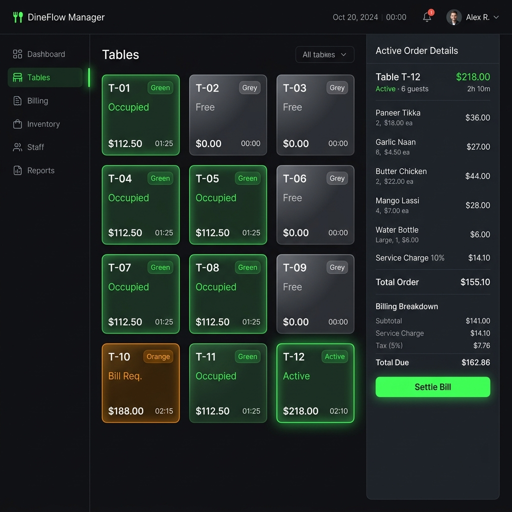
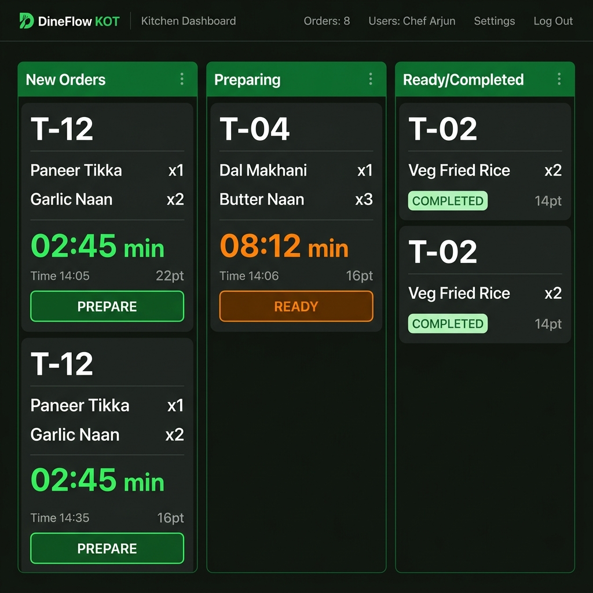
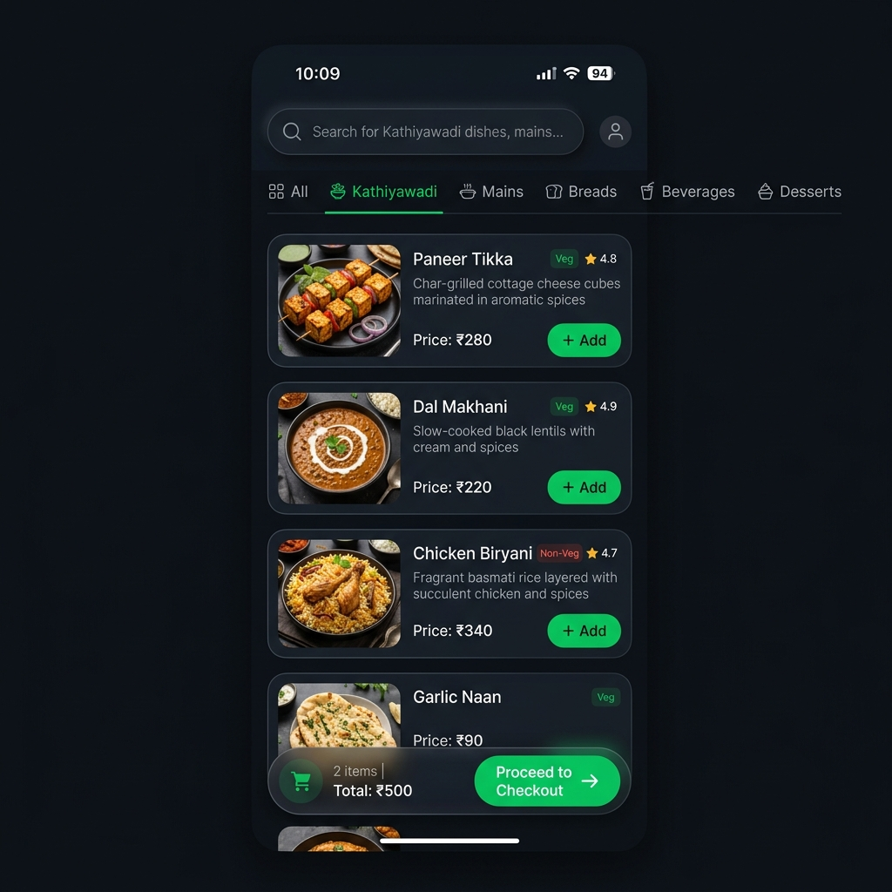

# DineFlow User Interface Walkthrough

DineFlow is designed with a premium, high-contrast dark aesthetic that balances visual clarity, functional density, and real-time feedback. 

Below are high-fidelity mockups of the key screens in the DineFlow system.

---

## 1. Manager Billing & Table Dashboard
The cashier counter billing and table status command center. It uses a 12-column grid to manage table seating, active orders, and fast checkout flows.

### Key Features
* **Table Grid Statuses**: Color-coded states indicating table status (occupied, available, bill requested).
* **Live Details Panel**: A dedicated checkout sidebar for the active table, displaying item counts, subtotal, and checkout options.
* **Responsive Layout**: Designed for tablets and desktop registers.

---

## 2. Kitchen KOT (Kitchen Order Ticket) Display
A large-format monitor view for kitchen staff to manage active prep orders in real-time. It groups orders into logical Kanban cards with timers.

### Key Features
* **Prep Columns**: Transition states from "New" to "Preparing" and "Ready".
* **KOT Details**: Clear quantities, table numbers, and custom preparation notes.
* **Timers**: Visual countdown/elapsed timers to track preparation SLA.

---

## 3. Guest Mobile QR-based Ordering Menu
The guest interface optimized for mobile browser screens, accessed directly by scanning table-specific QR codes.

### Key Features
* **Category Carousel**: Quick horizontal filters for menu items.
* **Veg / Non-Veg Badges**: Standard color indicators for dietary options.
* **Floating Cart Summary**: A bottom-fixed CTA showing checkout details and direct cart review.
